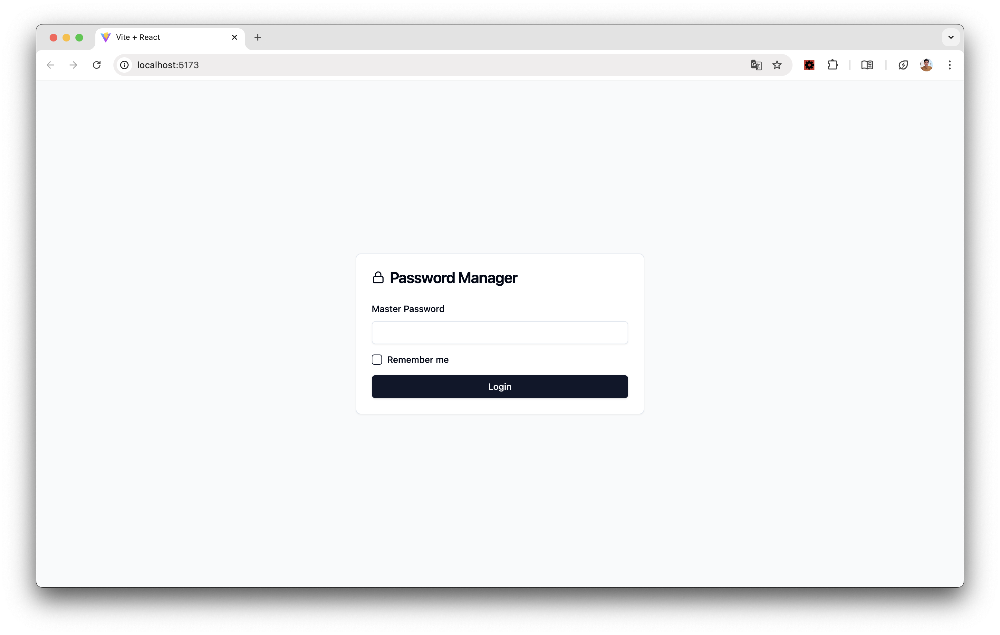
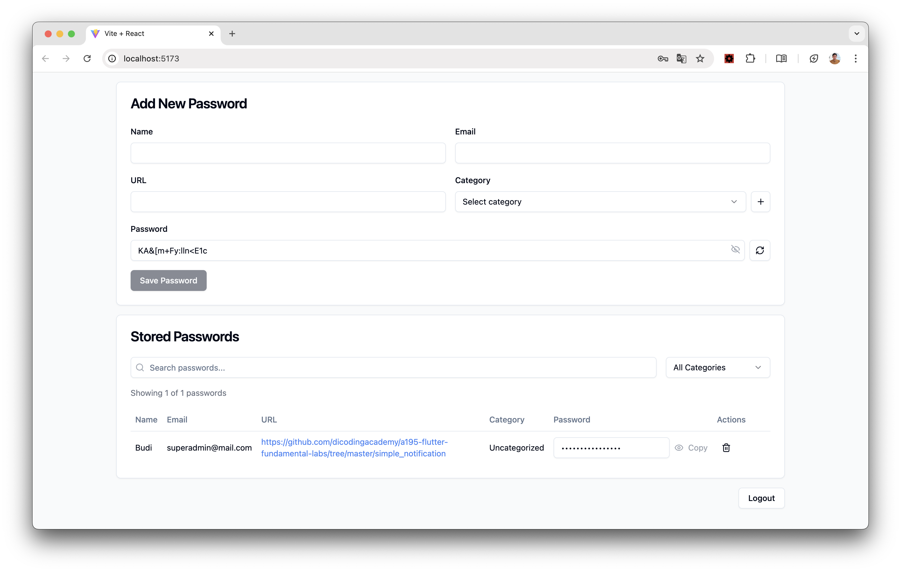

# Password Manager

A secure password manager application built with FastAPI (Python) and React.js. This application allows users to safely store and manage their passwords with features like category organization, password generation, & secure master password authentication. 

## Features

- 🔐 Master password authentication
- 📂 Password categorization
- 🔄 Password generation
- 🔍 Search and filter capabilities
- 📱 Responsive design
- 💾 Local session storage
- 🔒 Secure password storage

## Tech Stack

### Backend
- FastAPI (Python 3.8+)
- SQLite database
- uvicorn ASGI server
- Python packages:
  - fastapi
  - uvicorn
  - sqlite3 (built-in)
  - python-multipart
  - python-jose[cryptography]
  - passlib[bcrypt]

### Frontend
- React.js
- Tailwind CSS
- shadcn/ui components
- Radix UI primitives
- Local/Session Storage for auth persistence

## Getting Started

### Prerequisites
- Python 3.8 or higher
- Node.js 14 or higher
- npm or yarn

### Backend Setup

1. Navigate to the server directory:
```bash
cd server
```

2. Create and activate a virtual environment:
```bash
python -m venv venv

# On Windows
venv\Scripts\activate

# On macOS/Linux
source venv/bin/activate
```

3. Install dependencies:
```bash
pip install -r requirements.txt
```

4. Run the server:
```bash
python main.py
```

The server will start at `http://localhost:8000`

### Frontend Setup

1. Navigate to the client directory:
```bash
cd client
```

2. Install dependencies:
```bash
npm install
```

3. Run the development server:
```bash
npm run dev
```

The client will start at `http://localhost:5173`

## Project Structure

```
password-manager/
├── server/
│   ├── main.py
│   ├── requirements.txt
│   └── passwords.db
└── client/
    ├── src/
    │   ├── components/
    │   │   └── ui/
    │   ├── pages/
    │   │   └── PasswordManager.jsx
    │   ├── utils/
    │   │   └── authStorage.js
    │   ├── lib/
    │   │   └── utils.js
    │   ├── App.jsx
    │   └── main.jsx
    ├── public/
    ├── index.html
    ├── package.json
    ├── tailwind.config.js
    └── vite.config.js
```

## API Endpoints

### Authentication
- `POST /auth/login` - Login with master password
- `POST /auth/change-master-password` - Change master password

### Categories
- `GET /categories` - Get all categories
- `POST /categories` - Create new category

### Passwords
- `GET /passwords` - Get all passwords
- `POST /passwords` - Create new password
- `DELETE /passwords/{password_id}` - Delete password
- `GET /generate-password` - Generate random password

## Security Features

- Password hashing using SHA-256
- Session-based authentication
- Secure password storage
- CORS protection
- Input validation
- Optional "Remember Me" functionality

## Default Credentials

```
Master Password: admin123
```

## Contributing

1. Fork the repository
2. Create a new branch (`git checkout -b feature/amazing-feature`)
3. Commit your changes (`git commit -m 'Add amazing feature'`)
4. Push to the branch (`git push origin feature/amazing-feature`)
5. Open a Pull Request

## License

This project is licensed under the MIT License - see the LICENSE file for details.

## Acknowledgments

- [FastAPI](https://fastapi.tiangolo.com/)
- [React.js](https://reactjs.org/)
- [Tailwind CSS](https://tailwindcss.com/)
- [shadcn/ui](https://ui.shadcn.com/)
- [Radix UI](https://www.radix-ui.com/)

## Screenshots





## Future Enhancements

- [ ] Add dockerfile
- [ ] Make desktop app
- [ ] Password strength meter
- [ ] Export/Import functionality
- [ ] Password sharing capabilities
- [ ] Two-factor authentication
- [ ] Password expiry notifications
- [ ] Automatic password rotation
- [ ] Audit logs
- [ ] Browser extension
